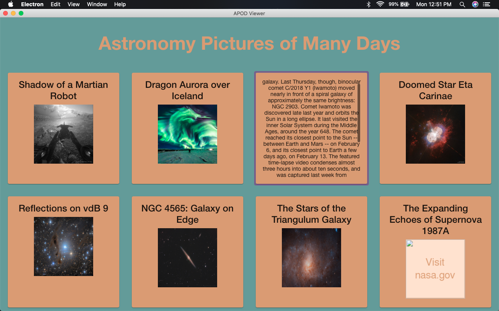
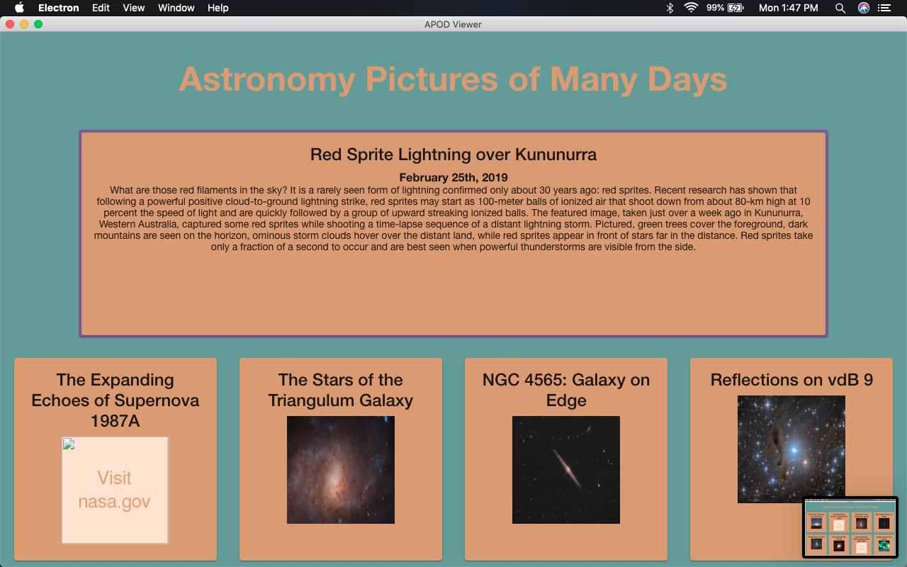

# Progress Screenshot Log
## Version 0

Here you can see the home view of the APOD-Calendar App. Each APOD has its own small card that displays data about the photo. The cards can be clicked to display a scrollable summary of the image, as represented by the 3 card over in the top row of this image. If a photo's image resource cannot be found, it will be represented with a placeholder image like the far right image on the bottom row.

## Version 0-1

Now each card expands to fill 4 columns, aka the full width of the application, and each card has its respective date on it.
